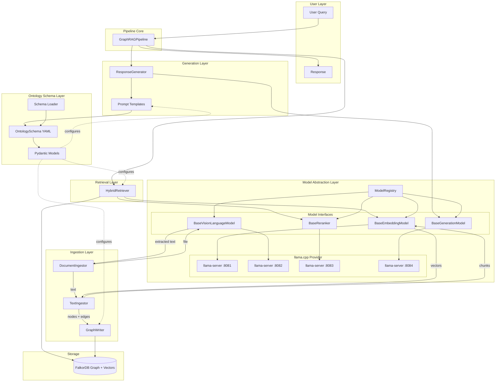
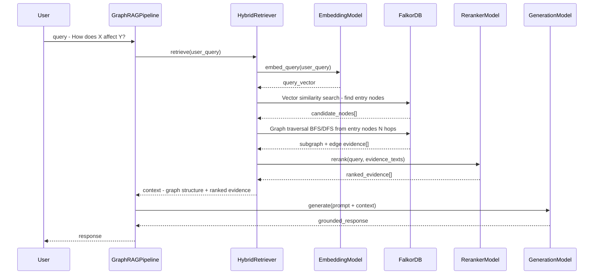
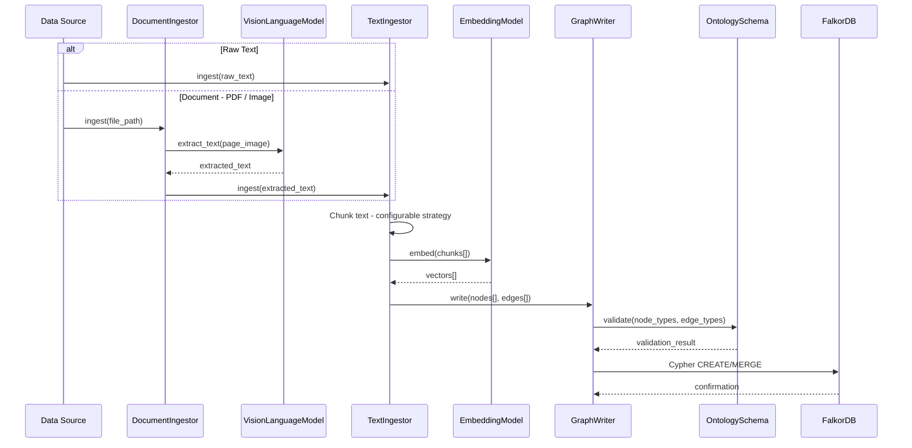

# Graph RAG Pipeline

A modular, schema-driven Retrieval-Augmented Generation (RAG) pipeline that combines knowledge graph traversal with vector similarity search. The pipeline is designed around three core principles: **interchangeable ontologies**, **model agnosticism**, and **local-first inference**.

## Key Features

- **Interchangeable Ontology** — Define any knowledge graph schema as a YAML file. The pipeline dynamically adapts its queries, prompts, ingestion, and retrieval to the loaded schema. Swap domains by swapping a config file.
- **Model Agnostic** — All model interactions (embedding, vision-language, re-ranking, generation) go through abstract interfaces. Bring your own models — the architecture supports any provider, with **llama.cpp** as the primary local backend.
- **Dual Ingestion Pathways** — Ingest data from raw text or documents (PDFs, images). Documents are processed through a Vision-Language Model for text extraction before entering the shared embedding pipeline.
- **Hybrid Retrieval** — Combines vector similarity search (for semantic entry points) with graph traversal (for structured, multi-hop reasoning) and re-ranking (for precision).
- **Graph-Grounded Generation** — LLM responses are grounded in evidence text extracted from graph edges, reducing hallucination.

## Tech Stack

| Component | Technology |
|:---|:---|
| Language | Python 3.10+ |
| Package Manager | Poetry |
| Graph Database | FalkorDB (with built-in vector search) |
| LLM Framework | Langchain (prompt templating and chain composition) |
| Local Inference | llama.cpp (`llama-server`) |
| Schema Definition | YAML + Pydantic validation |

---

## Architecture



> The pipeline loads a YAML ontology schema at startup. The schema drives query generation, prompt construction, ingestion validation, and retrieval behavior. All model calls are routed through abstract interfaces, with `llama-server` instances providing local inference.

---

## Data Flow

### Query Pipeline



### Ingestion Pipeline



---

## Components

### Ontology Schema Layer (`src/schema/`)

The schema layer is what makes this pipeline domain-agnostic. Instead of hardcoding entity types, relationships, and query patterns, these are declared in a YAML configuration file and loaded into validated Pydantic models at startup.

**Schema YAML structure:**

```yaml
name: my_domain
version: "1.0"
description: "Description of this knowledge domain"
graph_name: my_domain_graph  # FalkorDB graph name

node_types:
  EntityA:
    properties:
      id: {type: string, required: true}
      description: {type: string, embeddable: true}
      # properties marked 'embeddable: true' are used for vector search

edge_types:
  RELATES_TO:
    source: EntityA
    target: EntityB
    properties:
      confidence: {type: float}

traversal_patterns:
  impact_chain:
    description: "Trace impact from A through B to C"
    pattern: "(a:EntityA)-[:RELATES_TO]->(b:EntityB)-[:AFFECTS]->(c:EntityC)"
```

The schema configures:
- **Graph queries** — Cypher queries are generated dynamically from traversal patterns
- **Ingestion validation** — Nodes and edges are validated against declared types before writing to FalkorDB
- **Retrieval behavior** — `embeddable` properties determine which fields are indexed for vector search
- **Prompt construction** — The ontology description and type names are injected into LLM prompts

---

### Model Abstraction Layer (`src/models/`)

All model interactions go through abstract interfaces, enabling the pipeline to work with any inference backend. The primary target is **llama.cpp** (`llama-server`), which exposes OpenAI-compatible endpoints for all four model types.

| Model Type | Interface | Purpose | llama-server Endpoint |
|:---|:---|:---|:---|
| Embedding | `BaseEmbeddingModel` | Convert text to vectors for similarity search | `/v1/embeddings` |
| Vision-Language | `BaseVisionLanguageModel` | Extract text from images and PDFs (OCR) | `/v1/chat/completions` |
| Re-ranker | `BaseReranker` | Re-score retrieved candidates by relevance | `/v1/reranking` |
| Generation | `BaseGenerationModel` | Generate grounded natural-language responses | `/v1/chat/completions` |

**Local setup** — Each model type runs as a separate `llama-server` process:

```bash
# Embedding model
llama-server -m qwen3-embedding.gguf --port 8081 --embedding

# Vision-Language model
llama-server -m qwen2.5-vl.gguf --port 8082

# Re-ranker
llama-server -m bge-reranker.gguf --port 8083 --reranking

# Generation model
llama-server -m qwen2.5.gguf --port 8084
```

**Model Registry** — A factory that maps `(model_type, provider)` to concrete classes:

```python
embedding = ModelRegistry.create("embedding", "llama_cpp", base_url="http://localhost:8081/v1")
reranker  = ModelRegistry.create("reranker", "llama_cpp", base_url="http://localhost:8083/v1")
```

New providers (remote APIs, other local servers) can be added by implementing the base interface and registering with the registry.

---

### Ingestion Layer (`src/ingestion/`)

Two ingestion pathways feed data into the knowledge graph:

| Pathway | Input | Processing |
|:---|:---|:---|
| **Text** | Raw text strings or `.txt` files | Chunk → Embed → Write to graph |
| **Document** | PDFs, images, scanned docs | VLM extraction → Chunk → Embed → Write to graph |

Both pathways share a common pipeline tail:

1. **Chunking** — Text is split into chunks using a configurable strategy (fixed-size, semantic, sentence-level)
2. **Embedding** — Each chunk is embedded via `BaseEmbeddingModel`
3. **Schema validation** — Resulting nodes/edges are validated against the loaded `OntologySchema`
4. **Graph writing** — Validated data is written to FalkorDB via schema-aware Cypher `CREATE`/`MERGE` statements

The `DocumentIngestor` composes the `TextIngestor` — it extracts text via VLM, then delegates to the text pathway. This avoids duplicating chunking/embedding logic.

---

### Retrieval Layer (`src/retrieval/`)

The `HybridRetriever` combines three retrieval strategies:

1. **Vector search** — The user query is embedded and compared against node `embedding` fields in FalkorDB to find semantically relevant entry points
2. **Graph traversal** — From entry nodes, the retriever performs BFS/DFS up to N hops using the schema's traversal patterns, extracting the relevant subgraph and edge evidence text
3. **Re-ranking** — Retrieved evidence is re-scored by the `BaseReranker` to surface the most relevant context

The retriever is fully configured by the loaded `OntologySchema` — it knows which node properties are embeddable and which traversal patterns to execute.

---

### Generation Layer (`src/generation/`)

The `ResponseGenerator` assembles retrieved context into a structured prompt and passes it to the `BaseGenerationModel`:

1. **Schema-aware prompts** — The ontology description and entity/relationship types are dynamically injected into the system prompt, so the LLM understands the graph structure
2. **Evidence grounding** — Edge `evidence` text from traversed relationships is included in the prompt context
3. **Structured context** — The prompt template combines graph structure, ranked evidence, and any supplementary data into a single coherent context window

---

## Project Structure

```
graph-rag-demo/
├── schemas/                          # Ontology definitions (YAML)
│   └── gdelt_markets.yaml            # Example: GDELT × Equity Markets schema
├── src/
│   ├── config.py                     # Pydantic settings (env-driven)
│   ├── pipeline.py                   # Main pipeline orchestrator
│   ├── schema/                       # Ontology schema layer
│   │   ├── models.py                 # Pydantic models (OntologySchema, NodeType, EdgeType, etc.)
│   │   └── loader.py                 # YAML → OntologySchema loader
│   ├── models/                       # Model abstraction layer
│   │   ├── base.py                   # Abstract interfaces (Embedding, VLM, Reranker, Generation)
│   │   ├── registry.py               # Model factory/registry
│   │   ├── llama_cpp/                # llama.cpp provider
│   │   │   ├── client.py             # Shared HTTP client for llama-server
│   │   │   ├── embedding.py          # LlamaCppEmbeddingModel
│   │   │   ├── vlm.py                # LlamaCppVLM
│   │   │   ├── reranker.py           # LlamaCppReranker
│   │   │   └── generation.py         # LlamaCppGenerationModel
│   │   └── reranker/                 # Fallback providers
│   │       └── cross_encoder.py      # HFCrossEncoderReranker
│   ├── ingestion/                    # Data ingestion layer
│   │   ├── base.py                   # BaseIngestor interface
│   │   ├── text_ingestor.py          # Raw text → chunks → embeddings
│   │   ├── document_ingestor.py      # PDF/image → VLM extraction → text pipeline
│   │   └── graph_writer.py           # Schema-validated writes to FalkorDB
│   ├── retrieval/                    # Retrieval layer
│   │   └── hybrid_retriever.py       # Vector search + graph traversal + re-ranking
│   ├── graph/                        # Graph database layer
│   │   ├── client.py                 # FalkorDB connection (schema-driven)
│   │   └── queries.py                # Dynamic Cypher query builder
│   └── generation/                   # Generation layer
│       ├── prompts.py                # Schema-aware prompt templates
│       └── generator.py              # LLM response generation
├── tests/
│   ├── test_imports.py
│   ├── test_schema_loader.py
│   ├── test_model_registry.py
│   └── test_ingestion.py
├── main.py                           # CLI entry point
├── pyproject.toml                    # Poetry project configuration
├── .env.example                      # Environment variable template
└── knowledge_graph_schema.md         # Example schema documentation (GDELT)
```

---

## Configuration

All configuration is managed through environment variables (loaded from `.env` via Pydantic settings).

```bash
# Schema
SCHEMA_PATH=schemas/gdelt_markets.yaml

# FalkorDB
FALKORDB_HOST=localhost
FALKORDB_PORT=6379
FALKORDB_PASSWORD=

# Embedding Model (llama-server)
EMBEDDING_PROVIDER=llama_cpp
EMBEDDING_BASE_URL=http://localhost:8081/v1

# Vision-Language Model (llama-server)
VLM_PROVIDER=llama_cpp
VLM_BASE_URL=http://localhost:8082/v1

# Re-ranker (llama-server)
RERANKER_PROVIDER=llama_cpp
RERANKER_BASE_URL=http://localhost:8083/v1

# Generation Model (llama-server)
GENERATION_PROVIDER=llama_cpp
GENERATION_BASE_URL=http://localhost:8084/v1
```

---

## Getting Started

### Prerequisites

- Python 3.10+
- [Poetry](https://python-poetry.org/)
- [FalkorDB](https://www.falkordb.com/) (Docker recommended)
- [llama.cpp](https://github.com/ggerganov/llama.cpp) with `llama-server`
- GGUF model files for your chosen models

### Setup

```bash
# Clone the repository
git clone https://github.com/ggarcia209/graph-rag-demo.git
cd graph-rag-demo

# Install dependencies
poetry install

# Copy and configure environment
cp .env.example .env
# Edit .env with your settings

# Start FalkorDB
docker run -p 6379:6379 falkordb/falkordb

# Start llama-server instances (one per model)
llama-server -m /path/to/embedding-model.gguf --port 8081 --embedding
llama-server -m /path/to/vlm-model.gguf --port 8082
llama-server -m /path/to/reranker-model.gguf --port 8083 --reranking
llama-server -m /path/to/generation-model.gguf --port 8084

# Run the pipeline
poetry run python main.py

# Run tests
poetry run pytest tests/ -v
```

---

## License

This project is licensed under the Apache License 2.0 — see the [LICENSE](LICENSE) file for details.

