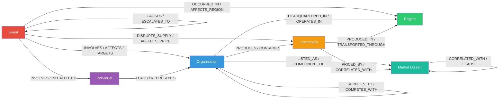

# Knowledge Graph Schema: GDELT Events × Equity Markets

> **Purpose**: Define the ontology (nodes + edges + properties) for a knowledge graph that connects geopolitical events from GDELT to time-series equity and commodity price data, enabling causal reasoning in a RAG pipeline.

---

## Design Principles

1. **GDELT-Native Mapping** — Entity and edge schemas align directly with GDELT's `(Actor1, EventCode, Actor2)` triple structure and GKG entity extraction so ingestion is straightforward.
2. **Temporal First-Class Citizen** — Every node and edge carries timestamps. The graph is a *dynamic* knowledge graph where relationships evolve over time.
3. **Causal Chain Traversal** — The schema is optimized for multi-hop queries of the form: *Event → affected Commodity/Sector → exposed Organization → equity price impact*.
4. **RAG-Oriented** — Each node stores a natural-language `description` field suitable for embedding and semantic retrieval. Edges store `evidence` text for grounding LLM responses.

---

## Entity (Node) Types

### 1. Event

Represents a discrete geopolitical, economic, or corporate occurrence sourced primarily from GDELT.

| Property | Type | Source | Description |
|:---|:---|:---|:---|
| `id` | `string` | Generated | Unique identifier (UUID or composite key) |
| `gdelt_event_id` | `string` | GDELT | `GlobalEventID` from GDELT event table |
| `event_code` | `string` | GDELT | CAMEO event code (e.g., `190` = Use conventional military force) |
| `event_root_code` | `string` | GDELT | Root CAMEO code for grouping (e.g., `19` = Military) |
| `description` | `string` | Derived / NLP | Human-readable summary of the event |
| `goldstein_scale` | `float` | GDELT | Impact score (−10 to +10); negative = destabilizing |
| `avg_tone` | `float` | GDELT | Average sentiment of media coverage |
| `num_mentions` | `int` | GDELT | Volume of media coverage |
| `num_sources` | `int` | GDELT | Number of distinct sources reporting |
| `event_date` | `datetime` | GDELT | When the event occurred |
| `date_added` | `datetime` | GDELT | When GDELT ingested the record |
| `source_urls` | `[]string` | GDELT | Source article URLs for provenance |
| `themes` | `[]string` | GDELT GKG | Extracted themes (e.g., `ECON_TRADE`, `MILITARY`) |
| `embedding` | `[]float` | Derived | Vector embedding of `description` for semantic search |

---

### 2. Organization

Represents a company, government body, NGO, or other institutional entity.

| Property | Type | Source | Description |
|:---|:---|:---|:---|
| `id` | `string` | Generated | Unique identifier |
| `name` | `string` | GDELT / Manual | Canonical entity name |
| `aliases` | `[]string` | Derived | Alternative names / spellings |
| `type` | `enum` | Derived | `CORPORATION`, `GOVERNMENT`, `NGO`, `MULTILATERAL`, `STATE_OWNED` |
| `ticker` | `string` | Market data | Stock ticker symbol (if publicly traded) |
| `exchange` | `string` | Market data | Exchange listing (e.g., `NYSE`, `NASDAQ`) |
| `sector` | `string` | Market data | GICS sector classification |
| `industry` | `string` | Market data | GICS industry sub-classification |
| `country` | `string` | Derived | Country of incorporation / headquarters |
| `description` | `string` | Derived | Natural-language summary |
| `market_cap` | `float` | Market data | Current market capitalization |
| `embedding` | `[]float` | Derived | Vector embedding for semantic search |

---

### 3. Individual

Represents a named person — political leader, executive, central banker, etc.

| Property | Type | Source | Description |
|:---|:---|:---|:---|
| `id` | `string` | Generated | Unique identifier |
| `name` | `string` | GDELT GKG | Canonical name |
| `aliases` | `[]string` | Derived | Alternative name forms |
| `role` | `string` | Derived | Current primary role/title |
| `affiliated_org_id` | `string` | Derived | FK → Organization this person leads or represents |
| `country` | `string` | Derived | Nationality / country of affiliation |
| `description` | `string` | Derived | Natural-language summary |
| `embedding` | `[]float` | Derived | Vector embedding for semantic search |

---

### 4. Market (Asset)

Represents a tradeable financial instrument or index with associated time-series price data.

| Property | Type | Source | Description |
|:---|:---|:---|:---|
| `id` | `string` | Generated | Unique identifier |
| `symbol` | `string` | Market data | Ticker / symbol (e.g., `AAPL`, `CL=F`, `^GSPC`) |
| `name` | `string` | Market data | Instrument name |
| `asset_type` | `enum` | Market data | `EQUITY`, `COMMODITY`, `INDEX`, `ETF`, `CURRENCY`, `BOND` |
| `exchange` | `string` | Market data | Exchange or market where traded |
| `sector` | `string` | Market data | GICS sector (equities only) |
| `industry` | `string` | Market data | GICS industry (equities only) |
| `currency` | `string` | Market data | Quote currency (e.g., `USD`) |
| `description` | `string` | Derived | Natural-language summary |
| `embedding` | `[]float` | Derived | Vector embedding for semantic search |

> [!NOTE]
> **Time-series price data** (OHLCV, returns, volatility) is stored as a separate time-series data store keyed by `Market.id` + timestamp — not as properties on the node itself. The graph node represents the *identity* of the asset; the time-series store holds the *observations*.

---

### 5. Commodity

Represents a physical commodity class that acts as a transmission channel between events and markets.

| Property | Type | Source | Description |
|:---|:---|:---|:---|
| `id` | `string` | Generated | Unique identifier |
| `name` | `string` | Manual / derived | Canonical name (e.g., `Crude Oil`, `Natural Gas`, `Wheat`) |
| `category` | `enum` | Derived | `ENERGY`, `METAL`, `AGRICULTURAL`, `INDUSTRIAL` |
| `benchmark_market_id` | `string` | Derived | FK → Market node for benchmark price (e.g., WTI for crude) |
| `description` | `string` | Derived | Natural-language summary |
| `embedding` | `[]float` | Derived | Vector embedding for semantic search |

---

### 6. Region

Represents a geographic area — country, sub-national region, or supranational bloc.

| Property | Type | Source | Description |
|:---|:---|:---|:---|
| `id` | `string` | Generated | Unique identifier |
| `name` | `string` | GDELT | Full name (e.g., `Ukraine`, `Strait of Hormuz`, `European Union`) |
| `geo_type` | `enum` | Derived | `COUNTRY`, `SUB_NATIONAL`, `SUPRANATIONAL`, `WATERWAY`, `REGION` |
| `country_code` | `string` | GDELT | ISO 3166-1 alpha-2 code (if applicable) |
| `fips_code` | `string` | GDELT | FIPS code from GDELT geo fields |
| `latitude` | `float` | GDELT | Centroid latitude |
| `longitude` | `float` | GDELT | Centroid longitude |
| `description` | `string` | Derived | Natural-language summary |
| `embedding` | `[]float` | Derived | Vector embedding for semantic search |

---

## Edge (Relationship) Types

All edges carry the following **common properties**:

| Property | Type | Description |
|:---|:---|:---|
| `confidence` | `float` | Confidence score (0.0–1.0) for how reliable this relationship is |
| `evidence` | `string` | Natural-language text grounding the relationship (for RAG retrieval) |
| `source` | `enum` | `GDELT`, `NLP_EXTRACTED`, `MARKET_DATA`, `MANUAL`, `STATISTICAL` |
| `created_at` | `datetime` | When this edge was created in the graph |
| `valid_from` | `datetime` | Start of the time window when this relationship is valid |
| `valid_to` | `datetime` | End of the time window (null = still active) |

---

### Event ↔ Event Edges

| Edge Type | Direction | Description | Example |
|:---|:---|:---|:---|
| `CAUSES` | Event → Event | Direct causal link between events | Russia invades Ukraine → EU imposes sanctions |
| `ESCALATES_TO` | Event → Event | Escalation in a chain of events | Diplomatic tensions → Military buildup → Armed conflict |
| `PRECEDES` | Event → Event | Temporal precedence (weaker than causal) | OPEC meeting → Oil supply cut announcement |
| `CORRELATES_WITH` | Event ↔ Event | Statistical co-occurrence without confirmed causation | Trade war rhetoric ↔ Currency devaluation |
| `RESPONDS_TO` | Event → Event | Reactive event in response to a prior event | Central bank rate hike responds to inflation report |

**Additional properties on Event ↔ Event edges:**

| Property | Type | Description |
|:---|:---|:---|
| `lag_hours` | `float` | Time delay between the two events |
| `causal_strength` | `float` | Estimated strength of causal link (0.0–1.0) |
| `mechanism` | `string` | Description of the transmission mechanism |

---

### Event ↔ Organization Edges

| Edge Type | Direction | Description | Example |
|:---|:---|:---|:---|
| `INVOLVES` | Event → Organization | Organization is a participant/actor in the event | Sanctions event involves Russian energy company |
| `AFFECTS` | Event → Organization | Event has a material impact on the organization | Oil embargo affects airlines |
| `INITIATED_BY` | Event → Organization | Organization initiated or caused the event | OPEC initiated production cut |
| `TARGETS` | Event → Organization | Organization is the target of the event | US sanctions target Huawei |

**Additional properties:**

| Property | Type | Description |
|:---|:---|:---|
| `actor_role` | `enum` | `ACTOR1`, `ACTOR2`, `MENTIONED`, `AFFECTED` (maps to GDELT actor fields) |
| `impact_direction` | `enum` | `POSITIVE`, `NEGATIVE`, `NEUTRAL` |
| `impact_magnitude` | `float` | Estimated severity of impact (0.0–1.0) |

---

### Event ↔ Individual Edges

| Edge Type | Direction | Description | Example |
|:---|:---|:---|:---|
| `INVOLVES` | Event → Individual | Person is a participant/actor | Summit involves heads of state |
| `INITIATED_BY` | Event → Individual | Person initiated the event | Executive order signed by president |
| `TARGETS` | Event → Individual | Person is the target | Sanctions target specific oligarch |
| `QUOTES` | Event → Individual | Person is quoted in event coverage | Fed chair's press conference |

---

### Event ↔ Region Edges

| Edge Type | Direction | Description | Example |
|:---|:---|:---|:---|
| `OCCURRED_IN` | Event → Region | Where the event took place | Conflict occurred in Eastern Ukraine |
| `AFFECTS_REGION` | Event → Region | Event has material impact on a region | Drought affects Midwest US |
| `ORIGINATES_FROM` | Event → Region | Event originated from a region | Trade policy originates from Beijing |

---

### Event ↔ Commodity Edges

| Edge Type | Direction | Description | Example |
|:---|:---|:---|:---|
| `DISRUPTS_SUPPLY` | Event → Commodity | Event disrupts supply of a commodity | Pipeline attack disrupts natural gas supply |
| `INCREASES_DEMAND` | Event → Commodity | Event increases demand | Cold snap increases demand for heating oil |
| `DECREASES_DEMAND` | Event → Commodity | Event decreases demand | Lockdowns decrease demand for jet fuel |
| `AFFECTS_PRICE` | Event → Commodity | General price impact (direction unspecified) | Trade tariff affects steel prices |

**Additional properties:**

| Property | Type | Description |
|:---|:---|:---|
| `price_impact_direction` | `enum` | `UP`, `DOWN`, `VOLATILE` |
| `supply_chain_stage` | `enum` | `PRODUCTION`, `TRANSPORT`, `REFINING`, `DISTRIBUTION` |

---

### Organization ↔ Market Edges

| Edge Type | Direction | Description | Example |
|:---|:---|:---|:---|
| `LISTED_AS` | Organization → Market | Org is listed as this tradeable asset | Apple Inc. is listed as AAPL |
| `COMPONENT_OF` | Organization → Market | Org is a component of an index | ExxonMobil is a component of S&P 500 |
| `TRACKS` | Market → Organization | ETF/fund tracks or holds the org | XLE ETF tracks ExxonMobil |

---

### Organization ↔ Organization Edges

| Edge Type | Direction | Description | Example |
|:---|:---|:---|:---|
| `SUPPLIES_TO` | Organization → Organization | Supply chain relationship | TSMC supplies to Apple |
| `COMPETES_WITH` | Organization ↔ Organization | Competitive relationship | Boeing competes with Airbus |
| `PARTNERS_WITH` | Organization ↔ Organization | Strategic partnership or JV | Shell partners with TotalEnergies |
| `SUBSIDIARY_OF` | Organization → Organization | Parent-subsidiary ownership | Instagram is subsidiary of Meta |
| `REGULATES` | Organization → Organization | Regulatory authority relationship | SEC regulates Goldman Sachs |

---

### Organization ↔ Commodity Edges

| Edge Type | Direction | Description | Example |
|:---|:---|:---|:---|
| `PRODUCES` | Organization → Commodity | Org produces/extracts this commodity | Saudi Aramco produces crude oil |
| `CONSUMES` | Organization → Commodity | Org is a major consumer/buyer | Delta Airlines consumes jet fuel |
| `TRADES` | Organization → Commodity | Org actively trades this commodity | Glencore trades copper |

**Additional properties:**

| Property | Type | Description |
|:---|:---|:---|
| `revenue_exposure_pct` | `float` | Estimated % of revenue tied to this commodity |
| `cost_exposure_pct` | `float` | Estimated % of costs tied to this commodity |

---

### Organization ↔ Region Edges

| Edge Type | Direction | Description | Example |
|:---|:---|:---|:---|
| `HEADQUARTERED_IN` | Organization → Region | Where the org is based | Shell is headquartered in Netherlands |
| `OPERATES_IN` | Organization → Region | Regions where org has operations | ExxonMobil operates in Nigeria |
| `REVENUE_FROM` | Organization → Region | Region is a significant revenue source | Apple has significant revenue from China |

---

### Commodity ↔ Market Edges

| Edge Type | Direction | Description | Example |
|:---|:---|:---|:---|
| `PRICED_BY` | Commodity → Market | Market instrument is the benchmark price | Crude oil is priced by CL=F (WTI futures) |
| `CORRELATED_WITH` | Commodity ↔ Market | Statistical price correlation | Natural gas prices correlated with utility ETFs |

**Additional properties:**

| Property | Type | Description |
|:---|:---|:---|
| `correlation_coefficient` | `float` | Pearson correlation over rolling window |
| `correlation_window` | `string` | Time window for correlation (e.g., `90d`) |
| `granger_p_value` | `float` | Granger causality test p-value |

---

### Commodity ↔ Region Edges

| Edge Type | Direction | Description | Example |
|:---|:---|:---|:---|
| `PRODUCED_IN` | Commodity → Region | Region is a major producer | Crude oil is produced in Middle East |
| `CONSUMED_IN` | Commodity → Region | Region is a major consumer | Natural gas is consumed in Europe |
| `TRANSPORTED_THROUGH` | Commodity → Region | Region is a transit corridor | Oil transported through Strait of Hormuz |

---

### Individual ↔ Organization Edges

| Edge Type | Direction | Description | Example |
|:---|:---|:---|:---|
| `LEADS` | Individual → Organization | Person is an executive/leader | CEO leads Apple |
| `BOARD_MEMBER_OF` | Individual → Organization | Person sits on the board | Director on Boeing board |
| `REPRESENTS` | Individual → Organization | Person officially represents the org | Ambassador represents a government |

---

### Market ↔ Market Edges

| Edge Type | Direction | Description | Example |
|:---|:---|:---|:---|
| `CORRELATED_WITH` | Market ↔ Market | Statistical price correlation | Oil futures correlated with energy ETF |
| `HEDGES` | Market → Market | One instrument hedges the other | Gold hedges equity index |
| `LEADS` | Market → Market | One instrument's price changes lead the other | VIX leads S&P 500 inversely |

**Additional properties:**

| Property | Type | Description |
|:---|:---|:---|
| `correlation_coefficient` | `float` | Pearson correlation over rolling window |
| `lead_lag_days` | `int` | How many days one leads/lags the other |
| `beta` | `float` | Regression coefficient |

---

## Example Traversal: Conflict → Oil Price → Airline Stock

Your motivating scenario traced through the graph:

```
[Event: "Military conflict in Middle East"]
   ──OCCURRED_IN──▶ [Region: "Strait of Hormuz"]
   ──DISRUPTS_SUPPLY──▶ [Commodity: "Crude Oil"]
        ──PRICED_BY──▶ [Market: "CL=F" (WTI Futures)] 📈 price spike
        ──CONSUMED──◀── [Organization: "Delta Air Lines"]
             ──LISTED_AS──▶ [Market: "DAL"] 📉 price drop
             ──COMPONENT_OF──▶ [Market: "^GSPC" (S&P 500)]
        ──CONSUMED──◀── [Organization: "United Airlines"]
             ──LISTED_AS──▶ [Market: "UAL"] 📉 price drop
        ──PRODUCED──◀── [Organization: "Saudi Aramco"]
             ──LISTED_AS──▶ [Market: "2222.SR"] 📈 price spike
```

**RAG query**: *"How would a military conflict near the Strait of Hormuz affect Delta Air Lines stock?"*

**Graph traversal for answer**:
1. Find `Event` nodes matching the query via semantic search on `description` embeddings
2. Traverse `DISRUPTS_SUPPLY` → `Commodity: Crude Oil`
3. Traverse `CONSUMED` ← `Organization: Delta Air Lines` (with `cost_exposure_pct` = high)
4. Traverse `LISTED_AS` → `Market: DAL`
5. Retrieve time-series data for DAL around similar historical events
6. Aggregate `evidence` text from all traversed edges to ground the LLM response

---

## Ontology Diagram



---

## RAG Pipeline Considerations

### Retrieval Strategy

| Step | Method | Description |
|:---|:---|:---|
| 1. Query Embedding | Vector similarity | Match user query against node `embedding` fields to find relevant entry points |
| 2. Subgraph Extraction | Graph traversal | BFS/DFS from entry nodes up to N hops to extract relevant subgraph |
| 3. Edge Evidence | Text retrieval | Collect `evidence` text from all traversed edges |
| 4. Time-Series Lookup | Key-value lookup | Fetch OHLCV data for relevant `Market` nodes around event dates |
| 5. Context Assembly | Template | Combine graph structure + edge evidence + price data into LLM context |

### Embedding Strategy

- **Node embeddings**: Embed `description` field of each node using a sentence transformer
- **Edge embeddings**: Embed `evidence` field for semantic edge matching
- **Hybrid retrieval**: Combine vector similarity with structured graph queries (e.g., "all organizations that CONSUME crude oil AND OPERATE_IN region X")

### Temporal Windowing

For RAG queries about market impact, the system should:
1. Find the event date from the `Event` node
2. Retrieve price data for a configurable window around that date (e.g., −5 to +30 trading days)
3. Calculate returns, volatility, and abnormal returns relative to a benchmark
4. Include this quantitative data in the LLM context alongside the graph evidence

---

## Open Design Questions

> [!IMPORTANT]
> The following decisions will affect the implementation significantly and should be resolved before building:

1. **Graph Database Selection** — Neo4j, Amazon Neptune, or TigerGraph? Each has different strengths for temporal graphs and RAG integration.
2. **Event Deduplication** — GDELT generates many records for the same real-world event. Do we deduplicate at ingestion time (cluster similar events into a canonical event) or keep the raw events and add `SAME_AS` edges?
3. **Edge Weight Computation** — For statistical edges like `CORRELATED_WITH` and `LEADS`, should these be pre-computed on a schedule (batch) or computed on-demand at query time?
4. **Commodity Granularity** — Should `Commodity` be a hierarchy (e.g., `Energy > Petroleum > Crude Oil > WTI`) or flat? A hierarchy enables more nuanced traversals but adds complexity.
5. **Historical Depth** — How far back should the graph go? GDELT data is available from 1979, but maintaining statistical edges across 45+ years of market data is expensive.
6. **Sector Node** — Should `Sector` be a separate entity type (instead of just a property on `Organization`), enabling direct `Event → AFFECTS → Sector` edges? This would simplify queries like "which sectors are most affected by trade wars?" without traversing through individual organizations.
